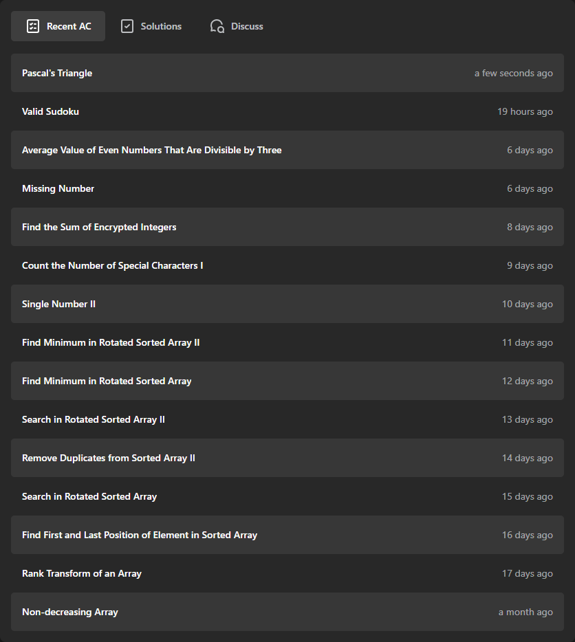

# My LeetCode Progress

###

   &nbsp; &nbsp; 
   

<h2 align="center">Last Submission</h2>

My snapshot of my current progress:

Total Problems Solved: 49

Easy: 33, Medium: 12, Hard: 4

[View My LeetCode Profile](https://leetcode.com/manansaipi)

## About

This repository contains solutions to various LeetCode problems. Feel free to explore the solutions and provide feedback or suggestions.
